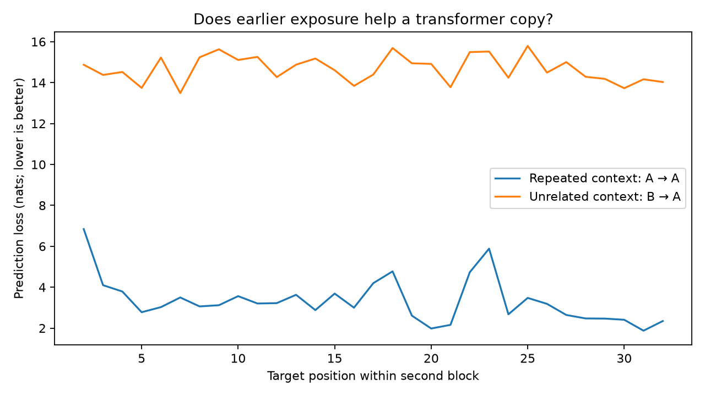
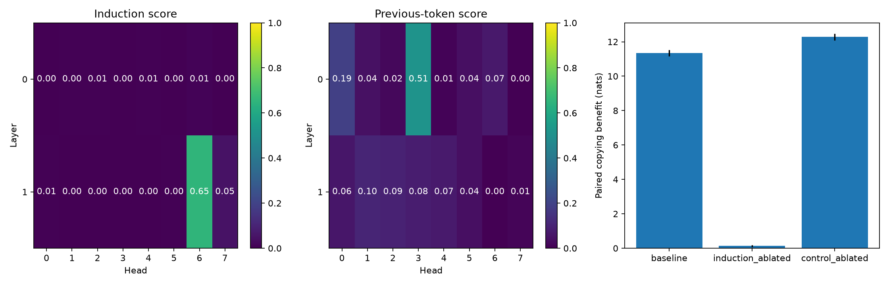

# How Transformers Copy

Reproducible experiments on sequence copying in a pretrained attention-only transformer. The current implementation measures the effect of repeated context on next-token prediction using matched target sequences.

## Method

Compare `BOS A A` with `BOS B A`, where A and B are independently sampled, uniformly distributed sequences of nonspecial token IDs. The second block has identical targets at identical absolute positions in both conditions. Exclude the first token in each block because it has no within-block prefix available for matching.

The primary metric is control-minus-repeated prediction loss, averaged over scored positions and then over sequence pairs. Positive values indicate a copying benefit. Loss is measured in nats.

## Baseline results

For `attn-only-2l`, with 32 tokens per block, 16 sequence pairs, and seed 42:

| Metric | Nats |
| --- | ---: |
| Repeated-context second-block loss | 3.33 |
| Control second-block loss | 14.67 |
| Paired copying benefit | 11.34 |
| Standard error across sequence pairs | 0.19 |



These results establish a behavioral effect under the sampled input distribution. They do not identify an induction circuit. Random token inputs are artificial and allow accidental matches. The standard error does not capture variation across seeds, models, or training runs.

## Induction heads and ablations

Every attention head is scored for **induction attention** (mean attention from a scored second-block query to the key holding the token it should copy) and **previous-token attention** (mean attention to the immediately preceding key), then the top induction heads are zero-ablated on `hook_z` and the paired copying benefit is recomputed. Zero-ablation forces the head's output to zero at every position; this is off-distribution for the model, so effect sizes should be read as evidence of contribution, not as precise causal estimates. A random, disjoint set of control heads with the same per-layer counts is ablated the same way to check that the effect isn't just "removing any two heads hurts"; the control heads are not screened, only recorded with their own scores.

For `attn-only-2l`, with the same 32-token blocks, 16 sequence pairs, and seed 42, ablating the top 2 induction heads:

| Head | Induction score | Previous-token score |
| --- | ---: | ---: |
| Layer 1, head 6 | 0.65 | 0.00 |
| Layer 1, head 7 | 0.05 | 0.01 |
| Layer 0, head 3 (highest previous-token score) | 0.01 | 0.51 |

| Condition | Paired copying benefit (nats) | Standard error |
| --- | ---: | ---: |
| Baseline (no ablation) | 11.34 | 0.19 |
| Top-2 induction heads ablated | 0.13 | 0.07 |
| 2 random control heads ablated (layer 1, heads 0 and 3) | 12.29 | 0.19 |

Both the repeated-context and control-context losses are measured under the same ablated model. Ablating the top two induction heads nearly eliminates the copying benefit (11.34 to 0.13 nats), while ablating two random control heads leaves it at or above baseline. This supports layer-1 heads 6 and 7 as the primary contributors to the behavioral copying effect measured above, with layer-0 head 3 acting as a previous-token head rather than an induction head.



## Reproduction

Requires Python 3.11 or 3.12 and [uv](https://docs.astral.sh/uv/). Dependencies are recorded in `uv.lock`.

```sh
UV_CACHE_DIR=.cache/uv uv sync --locked
PYTHONPATH=src uv run python -m copy_lab.experiment
PYTHONPATH=src uv run python -m copy_lab.heads
uv run jupyter lab notebooks/01_observe_copying.ipynb
uv run pytest
```

The initial run downloads pretrained weights and a tokenizer from Hugging Face. Caches stay in `.cache/`. CPU execution is verified; `--device mps` requests Apple GPU execution and has not been validated for this experiment.

Outputs are `results/summary.json`, `results/data.pt`, and `results/copying.png`. The committed files are the seed-42 baseline; pass `--output` to write a different configuration elsewhere rather than overwriting them.

```sh
PYTHONPATH=src uv run python -m copy_lab.experiment --seed 123 --samples 32 --output runs/seed123
```

`--model` accepts any TransformerLens pretrained name with a BOS token; the sequence must fit the model's context window.

## Development

Tests and lint run with:

```sh
uv run pytest
uv run ruff check .
uv run ruff format --check .
```

The test suite uses a fake model and does not download weights. Notebooks are excluded from ruff. `uv sync --no-default-groups` gives a minimal install without JupyterLab.

## Scope and planned experiments

The behavioral baseline, attention-pattern inspection, and head ablations with control heads are implemented. Planned extensions include replication across seeds and sequence lengths, and sensitivity to distractors and token substitutions.

## References

This project reproduces an established repeated-sequence evaluation using an existing pretrained model.

- [TransformerLens main demo](https://transformerlensorg.github.io/TransformerLens/generated/demos/Main_Demo.html): model loading and induction analysis.
- [ARENA transformer interpretability](https://learn.arena.education/chapter1_transformer_interp/02_intro_mech_interp/): induction circuits and experimental methods.

## License

Project code and notebooks are licensed under the [MIT License](LICENSE). Model weights and dependencies retain their own licenses.
